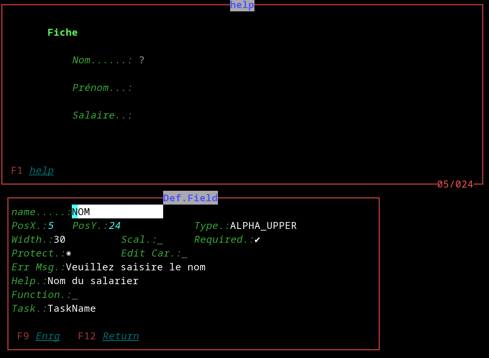
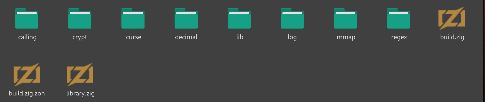
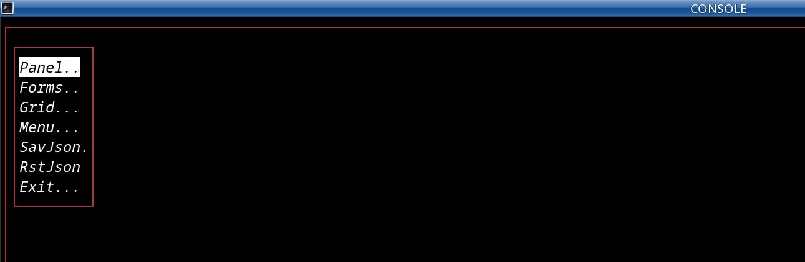
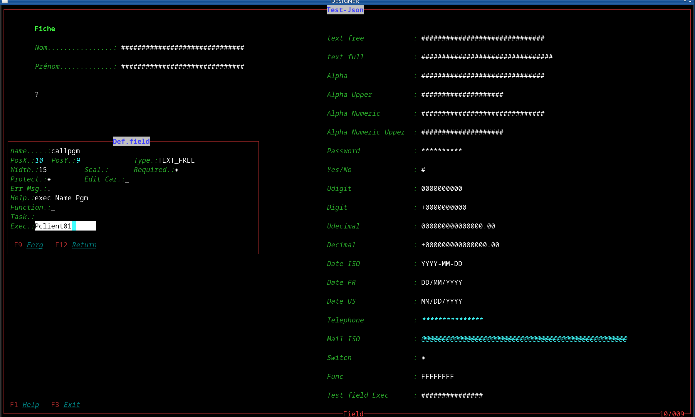

# zig_TermCurs

terminal access function  
<u>**zig 0.14.DEV**</u> 
 

**TESTING**  
*look at the bottom of the testing page*  

**os linux**  
<u>Normally should work POSIX </u> 
 
**the termcurs library, does what ncurse does (hopefully). 
it manages the interface between the terminal and the user. 
as does the 5250 of the OS400 with PC sauce. 
Panel, window, field, grid, menu etc. 
this can be used with a terminal with some editing eg: F10 etc. for convenience. 
the easiest way is to make your own terminal with libvte of which I provide an example in the src-c folder. 
this produces very lightweight programs for doing utilities or intensive typing for business management. 
Currently everything is not operational and the goal is to make a screen generator to simplify development, considering that this is only secondary and that the heart of the problem is the program itself and not the interface. **
 
** I use the gencurs program to thoroughly test the termcurs lib. **
 
 
Thank you 
a little more : XYAMAN
Resumption of the project https://github.com/xyaman/mibu 

Thank you 
https://zig.news/ 
https://zig.news/lhp/want-to-create-a-tui-application-the-basics-of-uncooked-terminal-io-17gm  
thank you for your valuable explanations   David Vanderson 
https://zig.news/david_vanderson   
Structure the complex build
https://zig.news/xq/zig-build-explained-part-3-1ima   

thank you for your valuable explanations  Sam Atman 
https://github.com/mnemnion/mvzr/   

extra..., to follow and have a history
https://github.com/kissy24/zig-logger/   
 

 

**In the example, some errors are introduced such as the mail, all of this is voluntary and allows you to see the default interaction of the input control. **
 

 

 

---

  

| Field                | Regex        | Text     | Type                                   |
| ---------------------- | -------------- | ---------- | ---------------------------------------- |
| TEXT_FREE            | Y            | Y        | Free                                   |
| TEXT_FULL            | Y            | Y        | Letter Digit Char-special              |
| ALPHA                | Y            | Y        | Letter                                 |
| ALPHA_UPPER          | Y            | Y        | Letter                                 |
| ALPHA_NUMERIC        | Y            | Y        | Letter Digit espace -                  |
| ALPHA_NUMERICT_UPPER | Y            | Y        | Letter Digit espace -                  |
| PASSWORD             | N            | Y        | Letter Digit and normaliz char-special |
| YES_NO               | N            | Y        | 'y' or 'Y' / 'o' or 'O'                |
| UDIGIT               | N            | Y        | Digit unsigned                         |
| DIGIT                | N            | Y        | Digit signed                           |
| UDECIMAL             | N            | Y        | Decimal unsigned                       |
| DECIMAL              | N            | Y        | Decimal signed                         |
| DATE_ISO             | DEFAULT      | Y        | YYYY/MM/DD                             |
| DATE_FR              | DEFAULT      | Y        | DD/MM/YYYY                             |
| DATE_US              | DEFAULT      | Y        | MM/DD/YYYY                             |
| TELEPHONE            | Y OR DEFAULT | Y        | +(033) 6 00 01 00 02                   |
| MAIL_ISO             | DEFAULT      | Y        | normalize mail regex                   |
| SWITCH               | N            | N / BOOL | CTRUE CFALSE                           |
| FUNC                 | N            | y        | **dynamic function call**              |
| TASK                 | N            | y        | **dynamic function call ex: control**  |
| CALL                 | N            | y        | **dynamic call exter                   |
|                      |              |          |                                        |

 
MOUSE 

| Type   | up | down | left | Middle | right | X/Y |
| -------- | ---- | ------ | ------ | -------- | ------- | ----- |
| Menu   | Y  | Y    | Y    | Y      | Y     | N   |
| GRID   | Y  | Y    | Y    | Y      | Y     | N   |
| FIELD  | Y  | Y    | Y    | Y      | Y     | N   |
| getKEY | Y  | Y    | Y    | Y      | Y     | Y   |
|    |    |      |      |        |       |     |

 
FIELD 

| KEY       | text                                           |
| ----------- | ---------------------------------------------|
| MOUSE     | mouse array reference                          |
| escape    | Restores the original area                     |
| ctrl-H    | Show help                                      |
| ctrl-P    | exec program extern                            |
| home      | Position at start of area                      |
| end       | Position at end   of area                      |
| right     | Position + 1 of area                           |
| tab       | Position + 1 of area                           |
| left      | Position - 1 of area                           |
| shift tab | Position - 1 of area                           |
| bacspace  | Position -1 of area and delete char            |
| bacspace  | Position  of area and delete char              |
| insert    | Position  of area   change cursor              |
| enter     | Control valide update origine next field       |
| up        | Control valide update origine prior field      |
| down      | Control valide update origine next field       |
| char      | Treatment of the character of the area         |
| func      | Interactive function linked to the input area. |
| task      | Task executed after input in the zone.         |
| call      | Interactive function exec program extern       |

 

GRID 

| KEY      | text         |
| ---------- | -------------- |
| MOUSE    | active       |
| escape   | return key   |
| F12      | return key   |
| enter    | return ligne |
| up       | prior  ligne |
| down     | next   ligne |
| pageUp   | prior  page  |
| pageDown | next   page  |
| return   | Arg          |

 

COMBO 

| KEY      | text                   |
| ---------- | ------------------------ |
| CellPos  | Position start display |
| MOUSE    | active                 |
| escape   | return key             |
| enter    | return field           |
| up       | prior  ligne           |
| down     | next   ligne           |
| pageUp   | prior  page            |
| pageDown | next   page            |
|      |                        |

  

<u>---Organization-project------------------------------------------</u> 
&rarr;&nbsp; folder deps: Filing of files zig including reference sources  
&rarr;&nbsp; folder library:  zig       source files  
&rarr;&nbsp; folder src_c:    C/C++     source files  
&rarr;&nbsp; folder src_zig:  ZIG-lang  source files  
&rarr;&nbsp; folder lib:      src xx.H  source files  
&rarr;&nbsp; build: build+source-name ex: buildexemple  
&rarr;&nbsp; makefile  
   
**LIBRARY**

  
<u>--peculiarity-------------------------------------------------</u> 
test alt-ctrl ctrshift... etc for  

But it is no longer transportable.
another way is to use IOCTL but again, there is a good chance of being forced to use root.

Anyway, to make management applications or Terminal type tools are more than enough.

ctrl or alt combinations plus Fn(1..36) TAB Backspace home end insert delete pageup pagedown enter escape alt ctrl left rigth up down altgr mouse
and the utf8 keyboard is a lot. 

<u>--styling-------------------------------------------------</u> 
make it compatible as close as possible to IBM 400 ex: 
 
ex: pub const AtrLabel : stl.ZONATRB = .{ 
&nbsp;&nbsp;&nbsp;.styled=[_]i32{@enumToInt(stl.Style.styleBright), 
&nbsp;&nbsp;&nbsp;&nbsp;&nbsp;@enumToInt(stl.Style.styleItalic), 
&nbsp;&nbsp;&nbsp;&nbsp;&nbsp;@enumToInt(stl.Style.notstyle), 
&nbsp;&nbsp;&nbsp;&nbsp;&nbsp;@enumToInt(stl.Style.notstyle)}, 
&nbsp;&nbsp;&nbsp;.backgr = stl.BackgroundColor.bgBlack, 
&nbsp;&nbsp;&nbsp;.backBright = false, 
&nbsp;&nbsp;&nbsp;.foregr = stl.ForegroundColor.fgGreen, 
&nbsp;&nbsp;&nbsp;.foreBright = true  
};

<u>-------Current treatments------------------------------------</u> 
&rarr;&nbsp; forms.zig  
&rarr;&nbsp; fram / panel / label /button / Menu / Grid / Combo / dynamic function Exec ** OK  
&rarr;&nbsp; Preparation of "Field" processing as well as keyboard input.

Please wait, if there are bugs everything is not fixed. 

<u>-------TESTING------------------------------------</u> 
&rarr;&nbsp; *Use the gtk Term.c terminal, it's much simpler terminals  ex: exf4-terminal*  
<u>-------To write and think--------------------------------</u> 
&rarr;&nbsp; inspiration ` `

* [nim-termcurs](https://github.com/AS400JPLPC) 

<u>---------------------------------------------------------</u> 
 
|   for information|
→  2023-02-28 
Hello, it is now possible to use a terminal without leaving a trace, I added in "curse" the "reset" function,
on the other hand, i included in the cls function the underlying cleanup of the terminal, i put here the terminal start function for, you help ( xfce4-terminal --hide-menubar --hide-scrollbar --hide -toolbar --geometry="158x42" --font="DejaVu Sans Mono 12" just add -e ./...program  
→  2023-02-28 
**Applications no longer need lib-GTK VTE**
in general to debug well, to use the console, it is advisable to deactivate preferences F10 and ALT... ,
then compile with SMALL and to ensure violation of ALT-F4 use the cpp program gtk-vte an example is there.
But in terminal mode the application is viable (to do with the commit data-base) 
 
→  2023-02-05 Doc version 0.11.1 "view use TermCurs"
[READ-DOCS](http://htmlpreview.github.io/?https://github.com/AS400JPLPC/zig_TermCurs/blob/master/Docs_Exemples/index.html)  
 

 

 
 
les news: 
 
→  2024-01-04 
LINUX 
Should it work with MAC? 
TRADUCTOR chatgpt 
Hello, there are very significant changes, why? 
Firstly, for better memory management. 
Greater coherence. 
All modules have their own allocators. 
Avoiding back-and-forth between modules. 
 
 
"CURSED" (named in memory of "NCURSEW"): 
Encompasses everything needed for writing to a terminal, including reading keyboard codes, mouse management, cursor handling, UTF8 work. I may introduce the "termios" concept for META codes. I took advantage of the restructuring to bring clarification. 
 
"FORMS": 
Includes management for: 
LABEL - BUTTON - LINEV - LINEH - FIELD - FRAME - PANEL 
Works with a matrix corresponding to the terminal surface so that the window can be restored. The FORMS allocator is designed for Fields and panel initialization. FORMS no longer includes GRID management, which is autonomous, nor MENU, which is autonomous 
 
"GRID": 
Functions similarly to forms, allowing the display and retrieval of arguments either from a database or working as a combo. It is autonomous, but you must consider that it should be included in your Panel, as it positions itself within the terminal window. 
 
"MENU": 
Operates like GRID but is much simplified; the returned argument is usize.which doesn't work with the matrix but directly with the terminal. 
 
"UTILS": (various tools and functions) 
Contains various functions to manage the control needs of FIELD or STRING management ([] u8 const). 
 
The Example program demonstrates how to manage and use these functions. A tip: the first Panel can serve as the definition of the terminal window. 
 
"MATCH": (regex MVZR pur zig) 
 
"LOGGER":  
Allows for a written record of variables or waypoints. 
 
"CALLPGM": Executes in Zig mode, manages the call and the wait. 
 

→  2024-04-23 
Adding the 'mdlGrid' function. 
- Alt-G: Create GRID definition 
- Alt-C: Create text columns 
- Alt-R: Remove GRID 
- Alt-W: Tools menu (View GRID, View Cell, Order Cell, Remove Cell) 

→  2024-07-27 
Added MENU definition function
you have to understand the menu option as a fixed combo with constant values  
- Alt-M: Create MENU definition 
- Alt-C: Create / UPDATE  text columns  
- Alt-W: Tools menu (View MENU, Remove MENU) 

→  2024-08-03 / 04  
*backup/restore* 
**add directory choice** 
**sort directory and files** 
- Small bug fixed with testing  
- this morning some big tests:  
- refining uppercase extended ascii mode 
- in-depth regex test MVRZR MACH activation 
- scan and roll test JSON  

→  2024-08-12 
-  upgrade version 0.13 / 0.14 token  
-  debug GRID  add type : 
I made an update in the GRID module: 

There are two ways to manage grids: 
a) Combo starts with the letter C. 
b) Grid starts with the letter G. 

Why this naming convention? It's for code generation. A Combo handles a single value and is loaded as a fixed value. 

For the Grid, it should be considered as a sub-file that can paginate, return multiple values, etc. 

Even though both use the same routines, the functionality is different. 
-  add orderGrid :  
-  add module Gensrc : 
-Added the Gensrc program, restructured logger (file), and added logcons (console). This program will create the reference between the functions areas and the Combo/Grid definitions.  

  

→  2024-08-14 
-  debug GRID While testing, I found a bug due to copy-paste Pagination with value return is correct. 
-  the same goes for allocator cleaning (when you want to do too well, you do too much. GRID management is no longer altered when using mdlPanel and mdlForms 
-  I think it will be possible to give names to the labels in order to be able to easily do on offs 
-  With the generation tests, I go around the whole thing again... 
-  ps : the structures do not move, except that I deleted redundant fn ioGridKeyfn ioGridKey  

 
→  2024-08-20 
-  Big glitch due to copy-paste reintroduction of ioGridkey function SORRY
-  Added reference list: Gensrc  The program is under development but functional It helps me to go around the project again and again.
 
------------------------------------------------------------------ 

Now that the entire designer allows for saving and restoring the code, this has allowed me to test my functions, and especially to take a little tour of the Zig language. I opted for working and writing with maximum use of the Zig language, so I don't use addressing or hex code; everything is in Zig.   

PAUSE   

In the current state, one could very well use JSON files and encapsulate them in the program, and why not make the forms in the project dynamic... I did this on the AS400. 
