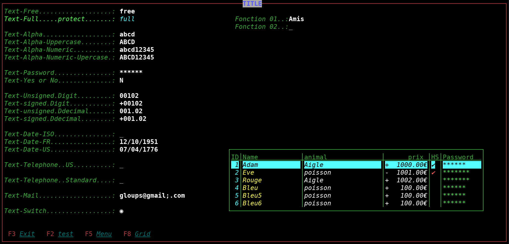
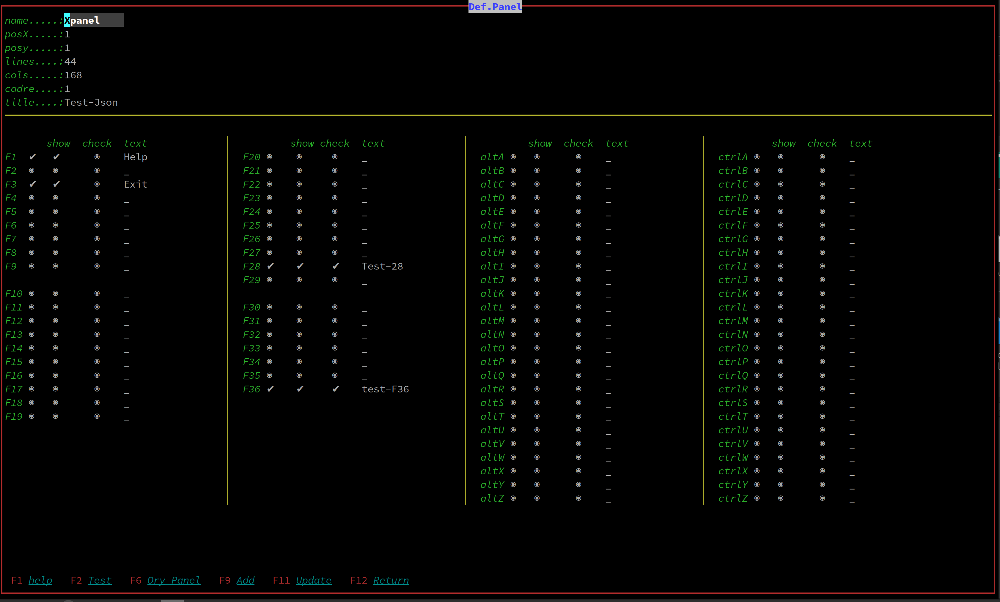

# zig_TermCurs

terminal access function  
<u>**zig 0.11.0**</u> 
 

**TESTING**  
*look at the bottom of the testing page*  

**os linux**  
<u>Normally should work POSIX </u> 
 
**the termcurs library, does what ncurse does (hopefully). 
it manages the interface between the terminal and the user. 
as does the 5250 of the OS400 with PC sauce. 
Panel, window, field, grid, menu etc. 
this can be used with a terminal with some editing eg: F10 etc. for convenience. 
the easiest way is to make your own terminal with libvte of which I provide an example in the src-c folder. 
this produces very lightweight programs for doing utilities or intensive typing for business management. 
Currently everything is not operational and the goal is to make a screen generator to simplify development, considering that this is only secondary and that the heart of the problem is the program itself and not the interface. **
 
** I use the gencurs program to thoroughly test the termcurs lib. **
 
 
Thank you
Resumption of the project https://github.com/xyaman/mibu
a little more : XYAMAN
 
Thank you
https://zig.news/ 
https://zig.news/lhp/want-to-create-a-tui-application-the-basics-of-uncooked-terminal-io-17gm 
https://zig.news/david_vanderson  thank you for your valuable explanations   David Vanderson  
https://zig.news/xq/zig-build-explained-part-3-1ima   Structure the complex build 
https://www.openmymind.net/Regular-Expressions-in-Zig/  inspiration 
 

 

**In the example, some errors are introduced such as the mail, all of this is voluntary and allows you to see the default interaction of the input control. **
 
 

 
---

  

| Field                | Regex        | Text     | Type                                        |
| -------------------- | ------------ | -------- | ------------------------------------------- |
| TEXT_FREE            | Y            | Y        | Free                                        |
| TEXT_FULL            | Y            | Y        | Letter Digit Char-special                   |
| ALPHA                | Y            | Y        | Letter                                      |
| ALPHA_UPPER          | Y            | Y        | Letter                                      |
| ALPHA_NUMERIC        | Y            | Y        | Letter Digit espace -                       |
| ALPHA_NUMERICT_UPPER | Y            | Y        | Letter Digit espace -                       |
| PASSWORD             | N            | Y        | Letter Digit and normaliz char-special      |
| YES_NO               | N            | Y        | 'y' or 'Y' / 'o' or 'O'                     |
| UDIGIT               | N            | Y        | Digit unsigned                              |
| DIGIT                | N            | Y        | Digit signed                                |
| UDECIMAL             | N            | Y        | Decimal unsigned                            |
| DECIMAL              | N            | Y        | Decimal signed                              |
| DATE_ISO             | DEFAULT      | Y        | YYYY/MM/DD                                  |
| DATE_FR              | DEFAULT      | Y        | DD/MM/YYYY                                  |
| DATE_US              | DEFAULT      | Y        | MM/DD/YYYY                                  |
| TELEPHONE            | Y OR DEFAULT | Y        | +(033) 6 00 01 00 02                        |
| MAIL_ISO             | DEFAULT      | Y        | normalize mail regex                        |
| SWITCH               | N            | N / BOOL | CTRUE CFALSE                                |
| FUNC                 | N            | y        | **dynamic function call**             |
| TASK                 | N            | y        | **dynamic function call ex: control** |
|                      |              |          |                                             |

 
MOUSE 

| Type      | up | down | left | Middle | right | X/Y |
| --------- | -- | ---- | ---- | ------ | ----- | --- |
| Menu      | Y  | Y    | Y    | Y      | Y     | N   |
| GRID      | Y  | Y    | Y    | Y      | Y     | N   |
| FIELD     | Y  | Y    | Y    | Y      | Y     | N   |
| getKEY    | Y  | Y    | Y    | Y      | Y     | Y   |
|   |    |      |      |        |       |     |

 
FIELD 

| KEY       | text                                      |
| --------- | ----------------------------------------- |
| MOUSE     | mouse array reference                     |
| escape    | Restores the original area                |
| ctrl-H    | Show help                                 |
| home      | Position at start of area                 |
| end       | Position at end   of area                 |
| right     | Position + 1 of area                      |
| tab       | Position + 1 of area                      |
| left      | Position - 1 of area                      |
| shift tab | Position - 1 of area                      |
| bacspace  | Position -1 of area and delete char       |
| bacspace  | Position  of area and delete char         |
| insert    | Position  of area   change cursor         |
| enter     | Control valide update origine next field  |
| up        | Control valide update origine prior field |
| down      | Control valide update origine next field  |
| char      | Treatment of the character of the area    |
| func      | dynamic function call                     |
| task      | dynamic function call for controle etc... |

 

GRID 

| KEY       | text                                      |
| --------- | ----------------------------------------- |
| MOUSE     | active                                    |
| escape    | return key                                |
| F12       | return key                                |
| enter     | return ligne                              |
| up        | prior  ligne                              |
| down      | next   ligne                              |
| pageUp    | prior  page                               |
| pageDown  | next   page                               |

 

COMBO 

| KEY       | text                                      |
| --------- | ----------------------------------------- |
| CellPos   | Position start display                    |
| MOUSE     | active                                    |
| escape    | return key                                |
| enter     | return field                              |
| up        | prior  ligne                              |
| down      | next   ligne                              |
| pageUp    | prior  page                               |
| pageDown  | next   page                               |
 

  
<u>---.VSCODE-------------------------------------------</u> 
&rarr;&nbsp; New methodology for clear compile.sh  
&rarr;&nbsp; New tasck.json  use: Task Manager  
 

<u>---Organization-project------------------------------------------</u> 
&rarr;&nbsp; folder deps: Filing of files zig including reference sources  
&rarr;&nbsp; folder src_c:    C/C++     source files  
&rarr;&nbsp; folder src_zig:  ZIG-lang  source files  
&rarr;&nbsp; folder lib:      src xx.H  source files regex.h 
&rarr;&nbsp; build: build+source-name ex: buildexemple  
&rarr;&nbsp; makefile  
 

<u>--peculiarity-------------------------------------------------</u> 
test alt-ctrl ctrshift... etc for  
there is a possibility to recover all the keys if we pass through GTK and use sys/shm.h.

But it is no longer transportable.
another way is to use IOCTL but again, there is a good chance of being forced to use root.

Anyway, to make management applications or Terminal type tools are more than enough.

ctrl or alt combinations plus Fn(1..24) TAB Backspace home end insert delete pageup pagedown enter escape alt ctrl left rigth up down altgr mouse
and the utf8 keyboard is a lot. 

<u>--styling-------------------------------------------------</u> 
make it compatible as close as possible to IBM 400 ex: 
 
pub const AtrLabel : stl.ZONATRB = .{ 
&nbsp;&nbsp;&nbsp;.styled=[_]i32{@enumToInt(stl.Style.styleBright), 
&nbsp;&nbsp;&nbsp;&nbsp;&nbsp;@enumToInt(stl.Style.styleItalic), 
&nbsp;&nbsp;&nbsp;&nbsp;&nbsp;@enumToInt(stl.Style.notstyle), 
&nbsp;&nbsp;&nbsp;&nbsp;&nbsp;@enumToInt(stl.Style.notstyle)}, 
&nbsp;&nbsp;&nbsp;.backgr = stl.BackgroundColor.bgBlack, 
&nbsp;&nbsp;&nbsp;.backBright = false, 
&nbsp;&nbsp;&nbsp;.foregr = stl.ForegroundColor.fgGreen, 
&nbsp;&nbsp;&nbsp;.foreBright = true  
};

<u>-------Current treatments------------------------------------</u> 
&rarr;&nbsp; forms.zig  
&rarr;&nbsp; fram / panel / label /button / Menu / Grid / Combo / **dynamic function call** OK  
&rarr;&nbsp; Preparation of "Field" processing as well as keyboard input.

Please wait, if there are bugs everything is not fixed. 

<u>-------TESTING------------------------------------</u> 
&rarr;&nbsp; *Use the gtk Term.c terminal, it's much simpler than xterm or other terminals*  
&rarr;&nbsp; forms.zig   Exemple --->  exemple.zig  
<u>-------To write and think--------------------------------</u> 
&rarr;&nbsp; inspiration ` `

* [nim-termcurs](https://github.com/AS400JPLPC) 
  &rarr;&nbsp; panel.zig   
  &rarr;&nbsp; label.zig   
  &rarr;&nbsp; field.zig   
  &rarr;&nbsp; menu.zig    
  &rarr;&nbsp; grid.zig    
  &rarr;&nbsp; button.zig  

<u>---------------------------------------------------------</u> 
 
 
 
 

<u>2023-02-26 correction code for (xxx.item) |l,i| new code ---> var idx: suize = 0 for (...) |l| { ... idx += 1;} 
 
<u>2023-05-22 correction code regex processing change no external software, only the libc with the regex.huse match 
 
 
 
|   for information|
→  2023-02-28 
Hello, it is now possible to use a terminal without leaving a trace, I added in "curse" the "reset" function,
on the other hand, i included in the cls function the underlying cleanup of the terminal, i put here the terminal start function for, you help ( xfce4-terminal --hide-menubar --hide-scrollbar --hide -toolbar --geometry="158x42" --font="DejaVu Sans Mono 12") just add -e ./...program  
→  2023-02-28 
**Applications no longer need lib-GTK VTE**
in general to debug well, to use the console, it is advisable to deactivate preferences F10 and ALT... ,
then compile with SMALL and to ensure violation of ALT-F4 use the cpp program gtk-vte an example is there.
But in terminal mode the application is viable (to do with the commit data-base) 
<u>I wish the friend google translate my french slang correctly </u>

les news: 

→  2023-02-05 Doc version 0.10.1  
[READ-DOCS](http://htmlpreview.github.io/?https://github.com/AS400JPLPC/zig_TermCurs/blob/master/docs_Gencurs/index.html)  
 

 

 
→  2023-05-22  changed regex processing, discontinued use of GO, and introduced regex.zig (https://github.com/tiehuis/zig-regex)  
 
→  2023-05-22  <s>add function match (match.zig) updating controls in forms with regex</s> 
→  2023-05-22  **add function isMatch regex.h libc  updating controls in forms with regex** 
→  2023-05-22  controls conform standard  
→  2023-05-22  ex: https://stackoverflow.com/questions/201323/how-can-i-validate-an-email-address-using-a-regular-expression 
→  2023-05-22  chapitre RFC 6532 updates 5322 to allow and include full, clean UTF-8. 
 

 
-  2023-06-19  Tuning and learning, memory management MODULE  
 
 
-  2023-06-20  Tuning  memory OK, I will be able to progress in the project  
 

 
-  2023-06-22  memory management validation  
-  2023-06-22  Simplification of registration of a grid and management of several grids  
-  2023-06-22  Enabling TTY output 
 

 
-  2023-08-1  I am preparing for the version change in order to take advantage of advancements and modify the code if necessary.
My experience, you have to review the "FOR" loop the "ENUM" and "BUILD" functions what I did 
 
-  2023-08-1  Studies of memory cleaning and various functions   0.11 
-  2023-08-1  Add func Grid  ioGridKey  (parm,parm, button KEY return) for management grid to grid ex: modlObjet fn Order  
 
-  2023-08-1  <u>Adjustment for 0.11 test  A lot of changes since version 0.10.1 </u>  
 
-  2023-08-1  look at the build has changed a lot.  
-  2023-08-1  Gencurs modlPanel OK  
-  2023-08-1  Gencurs modlObjet testing "label define  - order remove" OK  
-  2023-08-1  modlObjet alt-T Title alt-L Label  alt-w Menu(order/remove)  
-  2023-08-1  modlObjet ESC abord ctrl-V valide   F10 write all Objet for Panel ... F12 abord and return  
 
 
-  2023-08-1  Changing and reorganizing the code: 
-             new "grid.zig" 
-             the "forms.zig" no longer includes grid management 
-             I reviewed the initialization of the panel and grid 
-             with create mode to better manage memory and make memory allocation more consistent 
-             [ziggit](https://ziggit.dev/t/philosophical-question-about-memory/1343) 
-             testing memoory 
-             [zulipchat](https://zig-lang.zulipchat.com/#narrow/stream/346105-FR-General/topic/.E2.9C.94.20Debeuger)   
 
   
-  2023-08-4 Watch the build version zig 0.11.0 new formula to generate documentation 
 
-  2023-08-09 small update project due to version change 
-  2023-08-09 modlObjet alt-F start of field processing  
-  2023-08-09 Json studies to encapsulate the generation (IN/OUT)  

